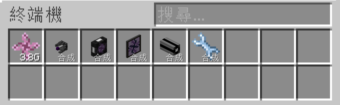
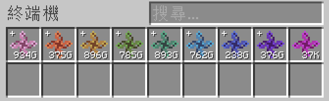

---
navigation:
  parent: appliede-index.md
  title: 轉換模組
  icon: emc_module
  position: 0
categories:
  - appliede
item_ids:
  - appliede:emc_module
---

# 轉換模組

<GameScene zoom="8" background="transparent">
  <ImportStructure src="assemblies/transmutation_module.snbt" />
</GameScene>

**ME 轉換模組**是你在 ME 網路中，運用 EMC 與煉金術的第一步。

當被連接在 ME 網路的「任何地方」時，模組會將玩家的 EMC 作為獨特資源供應給網路，並透過自動合成等方式，將玩家的 EMC 轉換成物品。

這些可由 EMC 轉換的物品，會自動產生虛擬的合成樣版供網路使用；發送這類物品的合成請求時，網路會以等價的 EMC 來合成這些物品。

一個網路中，可以同時存在多個由不同玩家放置的模組，

但每位煉金術士只會有 1 個模組，能對網路貢獻物品的 EMC 資料，並轉換成網路可「合成」的已知物品。

當網路中有多個轉換模組時，每個模組提供的 EMC，都會匯集在一個統一的儲存池裡。

任何從網路取出或存入的 EMC，都會盡可能地給所有提供 EMC 的玩家平均分擔。

模組還提供額外的保護措施，防止 ME 網路發生資料溢出問題，那就是「*EMC 等級*」系統。

透過將每「10^12」的 EMC 單位劃分一個等級，每個等級使用與 EMC 基本單位不同的顏色表示，

系統會根據需求，透過合成的方式將較高的 EMC 等級降級，來應對更高要求的轉換作業。

但請注意，使用模組提供的力量時，會伴隨著預設 25 AE/t 的巨大耗能，具體耗能取決於設定檔的設定。

## 配方

<RecipeFor id="appliede:emc_module" />
