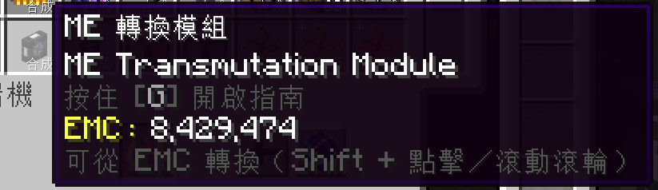
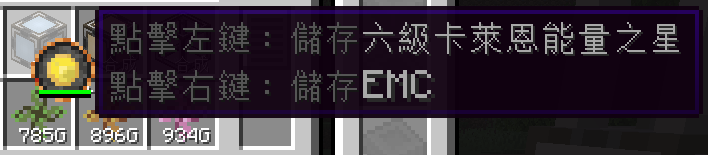
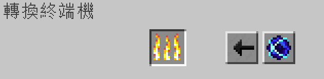
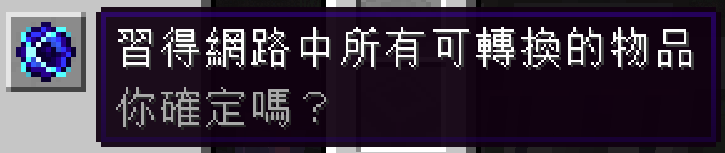

---
navigation:
  parent: appliede-index.md
  title: 轉換終端機
  icon: transmutation_terminal
  position: 20
categories:
  - appliede
item_ids:
  - appliede:transmutation_terminal
  - appliede:wireless_transmutation_terminal
---

# 轉換終端機

<GameScene zoom="8" background="transparent">
  <ImportStructure src="assemblies/transmutation_terminal.snbt" />
</GameScene>

至此，我們已經討論了 ME 網路，透過自動合成與 AppliedE 提供的各種 [轉換裝置](transmutation_devices.md)，將 EMC 轉換成物品的能力。

但仍有一個問題：玩家如何透過他們的 ME 系統，直接操控自己的 EMC？

這個問題的答案就是 **ME 轉換終端機**，這台終端機能提供使用者，許多來自 ProjectE <ItemLink id="projecte:transmutation_table" /> 的功能。

首先，有了這台終端機，玩家可以直接從儲存的 EMC 中，

取出已知的可轉換物品，這類物品不需要先存在於正常的物品儲存當中。

你還可以透過這台終端機，直接為卡萊恩能量之星，或其他儲存 EMC 的物品直接充能或清空能量。

終端機的畫面中，還包含著熟悉的轉換桌燃燒欄，玩家可以透過這個欄位將物品轉換成 EMC。

不過，畫面中還有兩顆額外的按鈕，為終端機提供了一些強大的功能。

左側的箭頭按鈕，用於切換玩家在 Shift + 點擊物品時，物品的去向。

如果箭頭指向上方的終端機物品欄，則玩家 Shift + 點擊的物品，將進入正常的物品儲存當中。

如果箭頭指向左側的轉換欄，則玩家 Shift + 點擊的任何物品，都將被轉換成 EMC，發送到網路的 EMC 儲存當中。

同時，如果該物品尚未被習得，還會為使用者習得該物品。

最後是這顆帶有奇點圖示的按鈕，使用後能讓終端機使用者，

自動將網路儲存當中，尚未習得的所有物品進行轉換。

然而，這可能得付出高昂的成本：物品只能在網路中數量至少有一個的情況下被習得，

而這當中的每種物品，都會被消耗其中一個並立即轉換成 EMC，根據物品的 EMC 值，這可能會產生巨大的能量消耗。

因此，建議謹慎使用，按鈕會在你決定透過它習得所有物品之前，提醒你必須三思而後行。

## 配方

<RecipeFor id="appliede:transmutation_terminal" />
