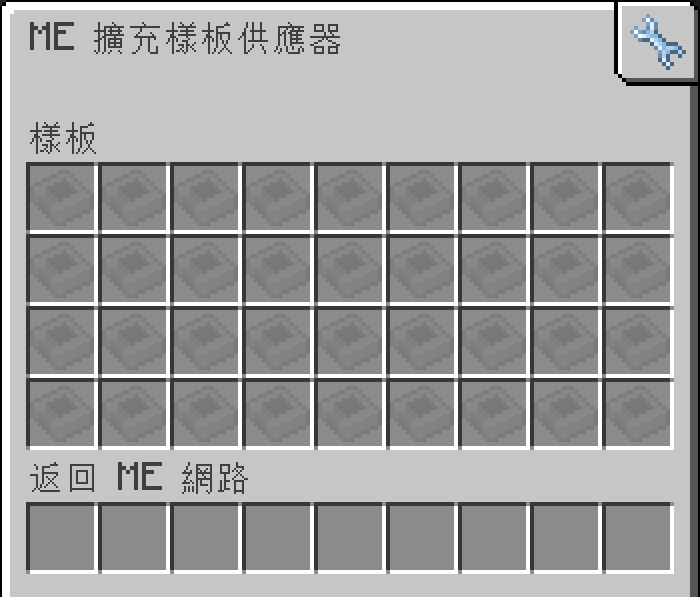

---
navigation:
    parent: epp_intro/epp_intro-index.md
    title: ME 擴充樣板供應器
    icon: expatternprovider:ex_pattern_provider
categories:
- extended devices
item_ids:
- expatternprovider:ex_pattern_provider
- expatternprovider:ex_pattern_provider_part
---

# ME 擴充樣板供應器

<Row gap="20">
<BlockImage id="expatternprovider:ex_pattern_provider" scale="8"></BlockImage>
<BlockImage id="expatternprovider:ex_pattern_provider" p:push_direction="up" scale="8"></BlockImage>
<GameScene zoom="8" background="transparent">
  <ImportStructure src="../structure/cable_ex_pattern_provider.snbt"></ImportStructure>
</GameScene>
</Row>

ME 擴充樣板供應器是擁有更多樣板欄位的 <ItemLink id="ae2:pattern_provider" />。

*若能夠將所有樣板集中在一個方塊裡，誰還會需要子網路。*

