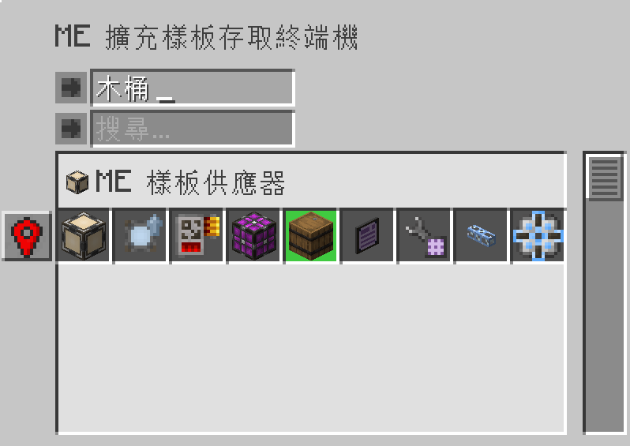

---
navigation:
    parent: epp_intro/epp_intro-index.md
    title: ME 擴充樣板存取終端機
    icon: expatternprovider:ex_pattern_access_part
categories:
- extended devices
item_ids:
- expatternprovider:ex_pattern_access_part
- expatternprovider:wireless_ex_pat
---

# ME 擴充樣板存取終端機

相比於 <ItemLink id="ae2:pattern_access_terminal" />，ME 擴充樣板存取終端機提供額外 3 種功能。

<Row gap="20">
<GameScene zoom="6" background="transparent">
<ImportStructure src="../structure/cable_ex_pattern_terminal.snbt"></ImportStructure>
<IsometricCamera yaw="180"></IsometricCamera>
</GameScene>
<ItemImage id="expatternprovider:wireless_ex_pat" scale="4"></ItemImage>
</Row>

## 更好的樣板搜尋

你可以透過「合成材料」或「合成產物」的名稱搜尋到樣板。

## 樣板醒目顯示

有些時候仍然難以找到自己所想要的樣板，因為樣板總是以群組的方式顯示。
但這一切都是過去式，現在你能使用擴充樣板存取終端機，在介面中醒目顯示相符的樣板。

## 醒目顯示世界上的樣板供應器

在進行大規模的合成作業時，要找到是哪台樣板供應器的作業中斷，會是一件相當煩人的事情。
但這一切都是過去式，現在你能使用擴充樣板存取終端機，在世界上醒目顯示樣板供應器，這樣你就能輕鬆地找到它們的位置。

