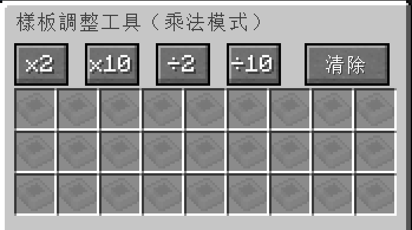
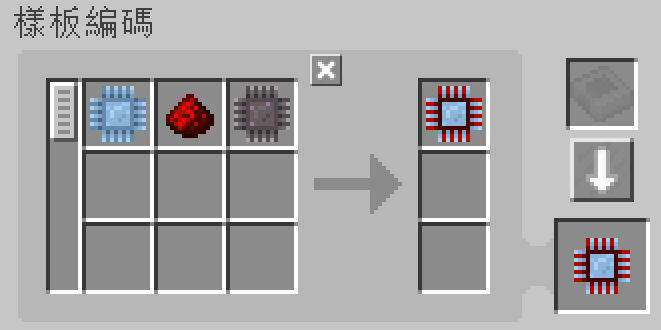
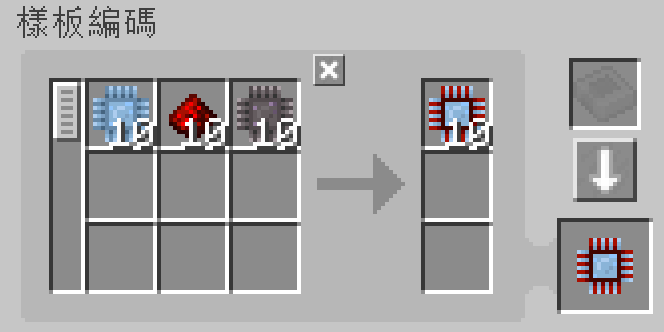
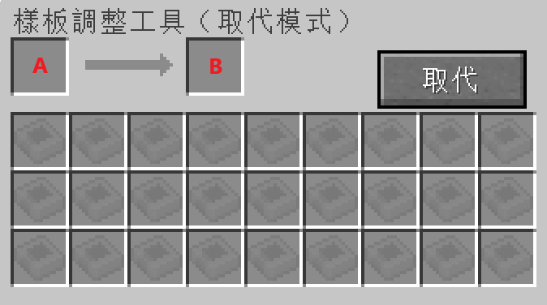
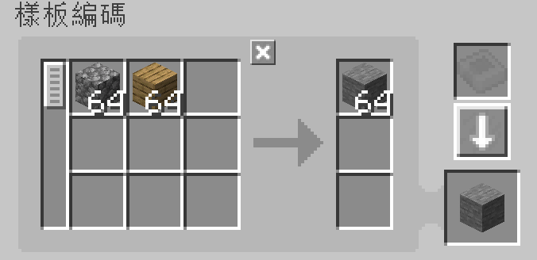
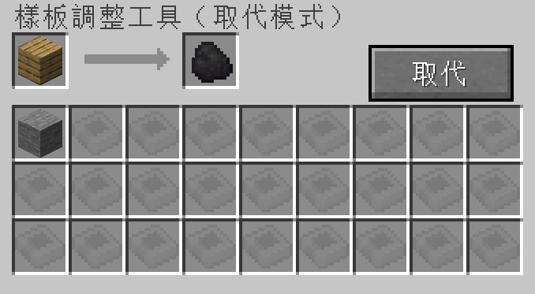
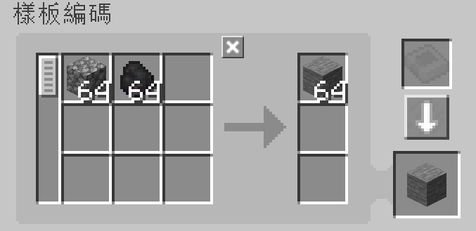
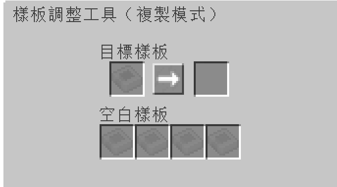

---
navigation:
    parent: epp_intro/epp_intro-index.md
    title: 樣板調整工具
    icon: expatternprovider:pattern_modifier
categories:
- extended items
item_ids:
- expatternprovider:pattern_modifier
---

# 樣板調整工具

樣板調整工具能夠對複數樣板進行批量調整。

<ItemImage id="expatternprovider:pattern_modifier" scale="4"></ItemImage>

點擊右鍵能夠開啟它的介面。

## 乘法模式

透過點擊對應的按鈕，你可以對處理樣板的合成材料與合成產物數量，進行乘法／除法運算。

原始樣板：

按下「x10」按鈕之後：

透過點擊「清除」按鈕，它還能夠將樣板上所編碼的內容全部清除，並將其轉變回空白樣板。

### 備註：

 - 除法按鈕僅在該數值能夠整除的情況下，才會起作用。例如：「÷2」按鈕在樣板需要 3 個鵝卵石作為合成材料時，不會起任何作用。因為 3÷2 是 1.5。

 - 乘法按鈕擁有上限值（999999）。它無法使單一種原材料的數量超過該數值。

## 取代模式

將樣板的某些合成材料以及合成產物，替換成其他物品。

欄位 A 是將被替換的內容，而欄位 B 則是被取代後的結果。

例如：根據下方圖片中的設定，橡木材將會被替換成煤炭。

點擊「取代」按鈕，即可進行替換。

## 複製模式

你可以在這個模式下，複製任何現有的樣板。  

