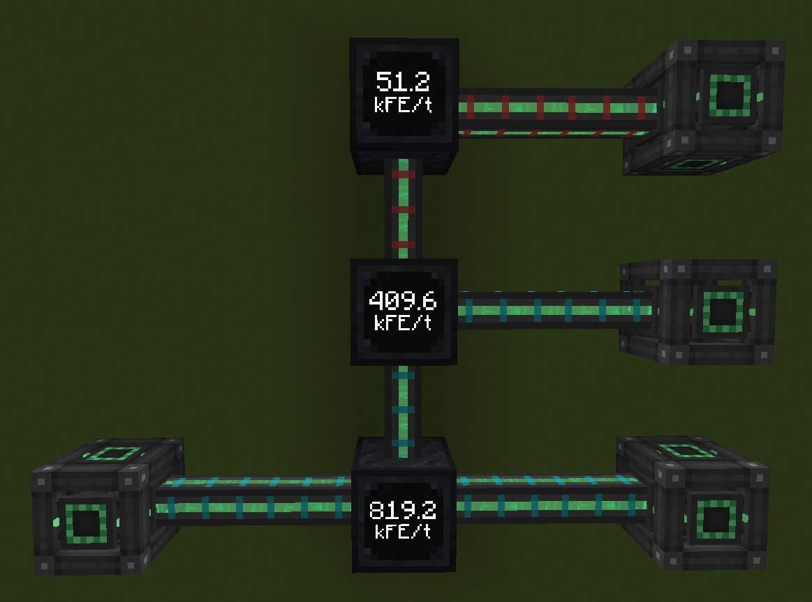

---
navigation:
  title: Energy Meter
  icon: meter
item_ids:
  - meter
---

# Energy Meter

Welcome to the introduction to the **Energy Meter** mod!

 

<FloatingImage src="assets/logo.png" align="right"/>

Energy Meter is a small content mod that adds a block called the <ItemLink id="meter" components="rarity=epic"/> which allows you to measure energy flow rates.
The block functions as a cable: incoming requests are simply forwarded to the outputs. All values of these requests are stored and used at
a configurable interval to calculate the flow rate.

In addition to a comprehensive user interface, the block also features a digital display on its front. The current rate can be checked
there at any time. The display can be rotated in any direction, including upwards and downwards. Since the front of the Energy Meter is
used for the display, only the remaining five sides can be configured as input or output.

To review the rates of previous intervals, the Energy Meter’s user interface also includes a graph view. This shows the measurements of
the last 10 intervals and can also be paused. The interface provides many additional configuration options. Besides different
measurement methods, both the measurement interval and the calculation mode can be adjusted. 
You can find more details on the [Interface](interface.md) page.

 
<RecipeFor id="meter"/>
