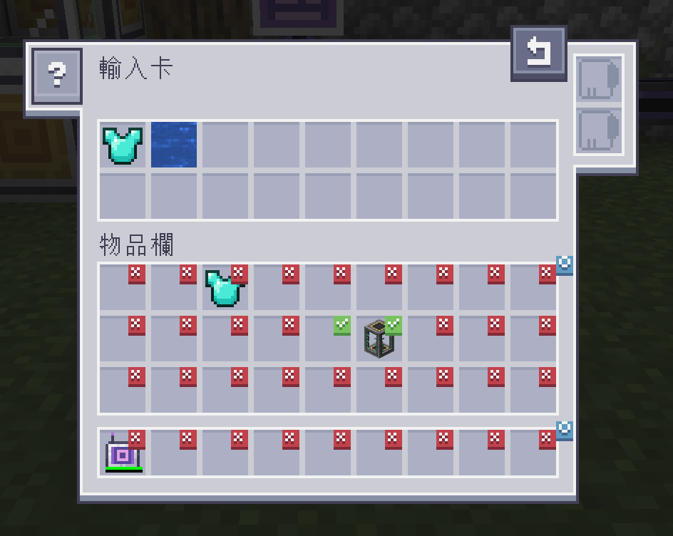
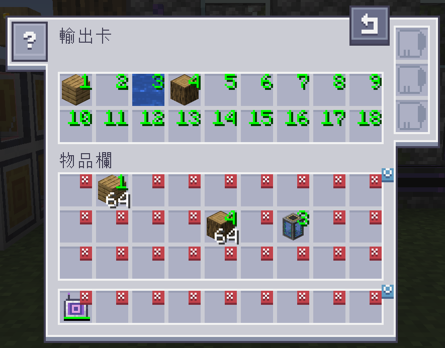

---
navigation:
  title: "擴充模組：AE2 輸入／輸出卡"
  icon: ae2importexportcard:export_card
  position: 150
categories:
  - tools
item_ids:
- ae2importexportcard:export_card
- ae2importexportcard:import_card
---

# AE2 輸入／輸出卡

<Row>
  <ItemImage id="ae2importexportcard:export_card" scale="2" />

  <ItemImage id="ae2importexportcard:import_card" scale="2" />
</Row>

輸入與輸出卡，能讓你在玩家物品欄與 ME 系統之間，進行自動化的物品傳輸。

---

# 輸入卡

<ItemImage id="ae2importexportcard:import_card" scale="2" />

輸入卡會從玩家的物品欄中，提取指定欄位的物品，並將其存入你的 ME 系統中。

點擊欄位會切換打勾標記。任何位於打勾欄位中的物品，都會被輸入至 ME 系統。

將物品從物品欄拖曳至上方的篩選欄位，即可變更篩選清單。

## 升級

輸入卡支援以下[升級卡](items-blocks-machines/upgrade_cards.md)：

*   <ItemLink id="fuzzy_card" />：根據物品的耐久度進行篩選，且／或無視物品的元件資料
*   <ItemLink id="inverter_card" />：將篩選模式從白名單切換至黑名單

## 合成配方

<RecipeFor id="ae2importexportcard:import_card" />

---

# 輸出卡

<ItemImage id="ae2importexportcard:export_card" scale="2" />

輸出卡的運作方式，基本上與輸入卡相同，

但它是從 ME 系統中，提取物品並放入你的物品欄。

若要指定物品，請將物品從物品欄拖曳至上方的篩選欄位，

並點擊物品欄中的欄位，以變更所需的數字（數字代表該欄位對應的篩選設定）。

對欄位點擊右鍵，即可清除設定並恢復為 X（代表不輸出至該欄位）。

## 升級

輸出卡支援以下[升級卡](items-blocks-machines/upgrade_cards.md)：

*   <ItemLink id="fuzzy_card" />：根據物品耐久度進行篩選，且／或無視物品的元件資料
*   <ItemLink id="speed_card" />：提升傳輸速度，從一次傳輸 1 個物品，提升至一次傳輸 1 組物品
*   <ItemLink id="crafting_card" />：當 ME 系統內的物品數量不足時，自動發起合成請求

## 合成配方

<RecipeFor id="ae2importexportcard:export_card" />