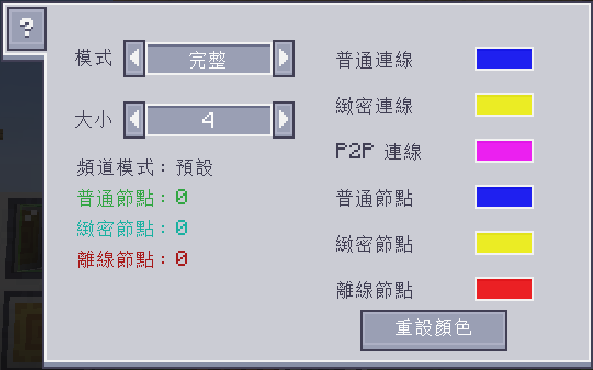

---
navigation:
    parent: ae2:items-blocks-machines/items-blocks-machines-index.md
    icon: ae2netanalyser:network_analyser
    title: ME 網路分析工具
categories:
- tools
item_ids:
- ae2netanalyser:network_analyser
---

# 分析 ME 網路

<ItemImage id="ae2netanalyser:network_analyser" scale="4"></ItemImage>

你是否曾為了找出 ME 網路中，哪個設備離線而感到苦惱？

或者只是想看看你的網路是如何運作的？

ME 網路分析工具就是為此而生的！

---

## 我的 ME 網路發生了什麼事？

點擊任何連接至 ME 網路的方塊、線纜或設備，

你就能看到每個設備的狀態，以及它們彼此之間的連接方式。

不同的顏色與形狀代表不同的狀態：
- 藍色方塊：普通 ME 設備，擁有足夠的頻道，且可傳輸 8 個頻道。
- 黃色方塊：緻密 ME 設備，擁有足夠的頻道，且可傳輸 32 個頻道。
- 紅色方塊：離線 ME 設備，頻道不足。
- 藍色連線：此連線最多可承載 8 個頻道。
- 黃色連線：此連線最多可承載 32 個頻道。
- 粉紅色連線：這是一個 ME P2P 連線。
- 數字：該連線目前所承載的頻道數量。

請注意，頻道數量上限取決於你的「ME 頻道模式」。

啟用「無限頻道」模式時，分析工具將不會顯示頻道數字。

---

## 自訂顯示

你可以在設定介面中，變更分析模式與顯示顏色。

ME 網路分析工具共有 5 種模式：
- 完整：顯示所有網路狀態。
- 節點：僅顯示節點狀態。
- 連線：僅顯示連線狀態。
- 隱藏數字：不顯示頻道數字。
- P2P：僅顯示 ME P2P 連線。

你也可以自行變更節點或連線的顏色。

