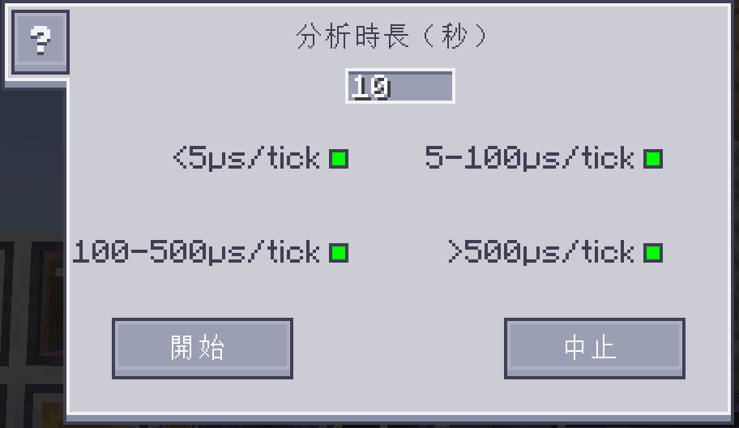

---
navigation:
    parent: ae2:items-blocks-machines/items-blocks-machines-index.md
    icon: ae2netanalyser:tick_analyser
    title: ME 效能分析工具
categories:
- tools
item_ids:
- ae2netanalyser:tick_analyser
---

# 分析 ME 刻速率

<ItemImage id="ae2netanalyser:tick_analyser" scale="4"></ItemImage>

當你的 ME 網路規模非常龐大時，遊戲有時會變得非常卡頓，

但要從網路中精確找出導致卡頓的源頭，通常十分困難。

現在，你可以透過 ME 效能分析工具，輕鬆地找出問題所在。

---

## 是什麼讓你的遊戲變卡？

部分 AE 設備會在遊戲刻期間執行工作。

ME 效能分析工具可以測量它們完成工作所需的時間（μs/刻），

並將這些數字直接顯示在遊戲世界中，幫助你找出誰佔用了最長的時間。

> 注意：為了防止工具遭到濫用，在多人伺服器中，你需要擁有 OP 權限，才能使用此工具。

* 顏色標示：代表方塊的卡頓程度，顏色越紅代表該設備越耗費效能。
* 數字標示：代表該方塊的刻速率（處理耗時）。

當 TPS（每秒刻數）低於 20 時，遊戲就會開始卡頓。

換句話說，單個遊戲刻的處理時間，應始終低於 50,000 μs/刻。

一般來說，大多數方塊的處理耗時，應低於 100 μs/刻，否則它們很有可能導致整體的 TPS 下降。

---

## 自訂顯示

你可以在設定介面中，控制不同刻速率範圍，是否在遊戲世界中顯示。

綠色圓點代表顯示該刻速率範圍內的方塊。

點擊圓點即可啟用／停用該範圍的顯示。
