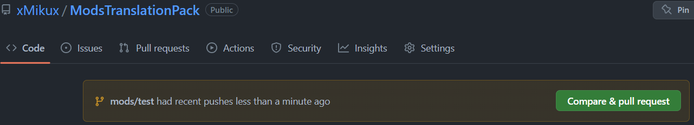

# 歡迎來到模組翻譯包貢獻指南

感謝你想幫助這個小小模組翻譯專案！

我們歡迎你對本專案進行任何貢獻，就算你是第一次翻譯、使用版本控制系統（Git）。

如果有需要更多翻譯與使用 GitHub、Git 相關的幫助，請考慮加入我們的 [Discord][discord-invite]！

## 🐞 Issues (錯誤回報)

如果遇到翻譯上有錯誤，可以考慮加入 [Discord][discord-invite]，或是在 GitHub 上打開一個新 Issue（問題）。

你也可以選擇查看下方的 PR（合併請求），來了解如何貢獻你的修正或翻譯！

## ✨ Pull Request (合併請求)

我們對於合併請求有一定的要求，來確保玩家在使用翻譯包時能有良好的翻譯品質！

對於翻譯相關的指南，可以參考下列網站：

- [MDN 翻譯內容指導原則][mdn-translate-guide]
- [微軟語言入口網站][microsoft-lang-portal]

版本控制或者其他教學文章：

- [第一次參與開源][first-contributions]

當你完成你的翻譯或修正後，可以來開始進行 PR（合併請求）。

這裡只會對網頁端的方式進行教學，你可以用各種其他的版本控制系統相關的程式完成這個。

如果你是用其他程式，可以直接跳到[約定式提交](#-約定式提交)。

### Fork 分叉

首先我們需要分叉此專案，Fork 的按鈕會在此專案的最右側

[](./assets/Forking.png)

點擊該按鈕將會分叉儲存庫到你自己帳號底下

### 網頁編輯介面

當你跳轉到你剛分叉好的專案時，請按下鍵盤上的 ``.``

你將會開啟類似於圖片中的網頁編輯介面

[](./assets/WebEditor.png)

### 上傳你的翻譯

它就跟你在電腦上用資源包翻譯一樣

將你的翻譯放入 assets/ID/lang 之中即可！

請記住你也必須上傳原始語言檔案 en_us.json 上去

### 提交翻譯

當你上傳好你的翻譯之後，你會發現左側的選單出現了變動數字

類似於這張圖

[](./assets/SourceControl.png)

點數字那邊，並將你的提交訊息寫入，詳細請查看[約定式提交](#-約定式提交)

並按下 ``Commit & Push`` 即可完成提交至遠端！

### 建立合併請求

當你成功提交你的翻譯後，你回到[模組翻譯包][github]的儲存庫時，會看到一些新的東西！

[](./assets/CompareChange.png)

按下 ``Compare & pull request`` 比對和合併請求的綠色按鈕將會轉到開啟合併請求的頁面

[](./assets/OpenPR.png)

標題通常會依照你第一個提交訊息而自動放上，如果你有複數個提交訊息，請手動調正。

往下滑將會看到你的提交記錄與你所要提交的檔案，確認無誤後按下 ``Create pull request`` 建立合併請求的綠色按鈕即可完成！

### 審核

建立完之後，將會由專案維護者們進行審核

它們會跟你討論或是提出修改哪裡會更好

當審核人員核准你的 PR 後，將會合併進翻譯包中

🎉 恭喜你完成你神聖的貢獻！

翻譯將會在下一次發佈版本時出現，或是你也可以在[翻譯包測試版][pre-release]中下載到

### 📖 約定式提交

本專案使用了[約定式提交][conventionalcommits]來進行維護。

變更日誌也是靠此來進行產生的！

提交格式將會像是以下一樣：

```md
<類型>(模組或是其他): <描述>

[可選的解釋或其他]

[可選的頁角]
```

我們所使用的類型是有自訂過的，來符合本專案所需。

模組相關類型：

- mods_feat 新增模組翻譯
- mods_update 更新模組翻譯
- mods_fix 修正模組翻譯錯誤
- mods_improve 提升模組翻譯品質
- mods_localize 用語在地化
- mods_remove 移除翻譯

專案維護類型：

- feat 次版本號提升
- fix 修正問題
- chore 清理專案
- ci 持續整合 / 持續佈署
- docs 文件更新
- refactor 重構

對於你想貢獻你剛翻好的新模組，你可以照著底下的格式輸入

不一定需要版本，但對於後續更新，有個版本仍然會讓你更好知道此翻譯是建立於哪個版本時

```commit
mods_feat(模組名): 模組譯名 v1.0.0
```

其他類型也差不多跟上面一樣，只要把前面的類型換成其他種即可

對於不熟悉這種規則，或是不確定這樣做是否正確

不用擔心，你只需建立你的 PR，我們將會告訴你該怎麼修正！

<!-- 連結 -->
[github]: https://github.com/xMikux/ModsTranslationPack/
[pre-release]: https://github.com/xMikux/ModsTranslationPack/releases/tag/latest-build
[discord-invite]: https://discord.gg/7BbPMtygHU
[mdn-translate-guide]: https://github.com/mdn/translated-content/blob/main/docs/zh-tw/translation-guide.md
[microsoft-lang-portal]: https://www.microsoft.com/zh-tw/language/
[conventionalcommits]: https://www.conventionalcommits.org/zh-hant/v1.0.0/
[first-contributions]: https://github.com/firstcontributions/first-contributions/blob/main/translations/README.zh-tw.md
